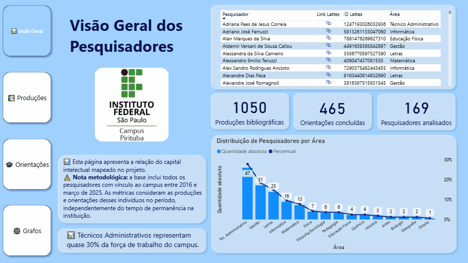
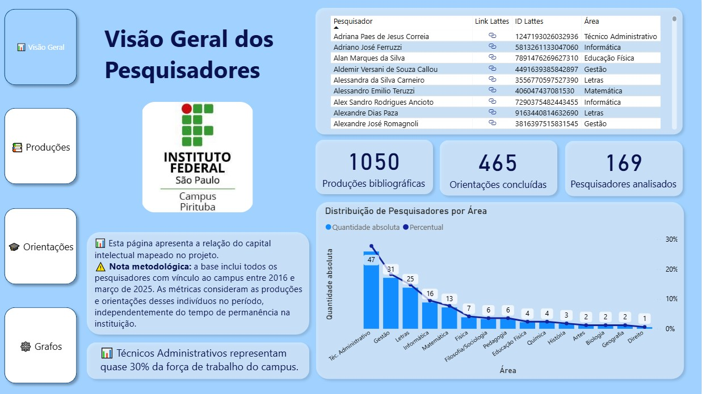
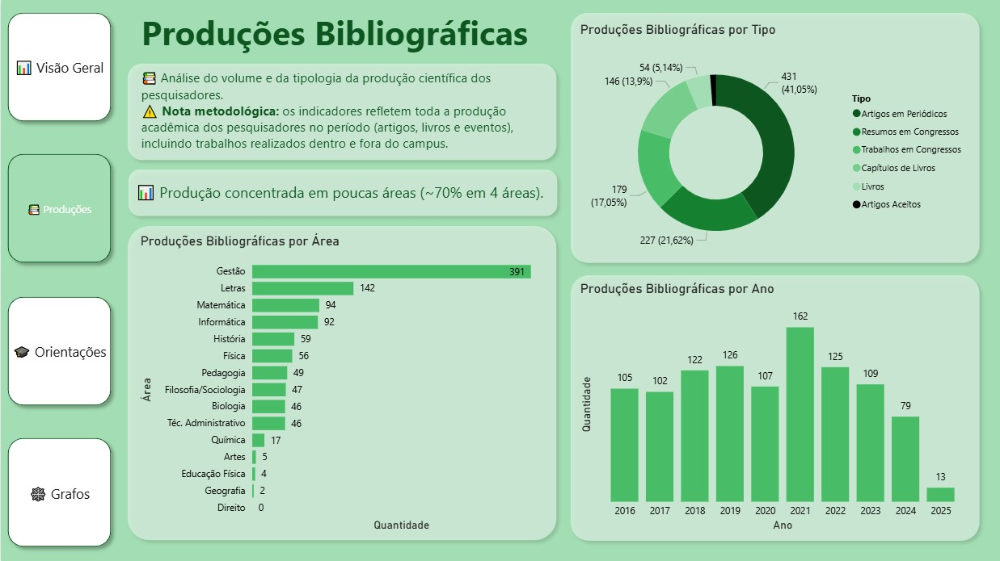
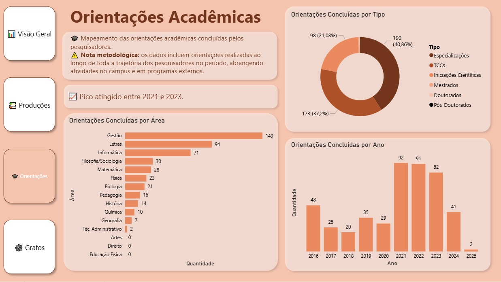
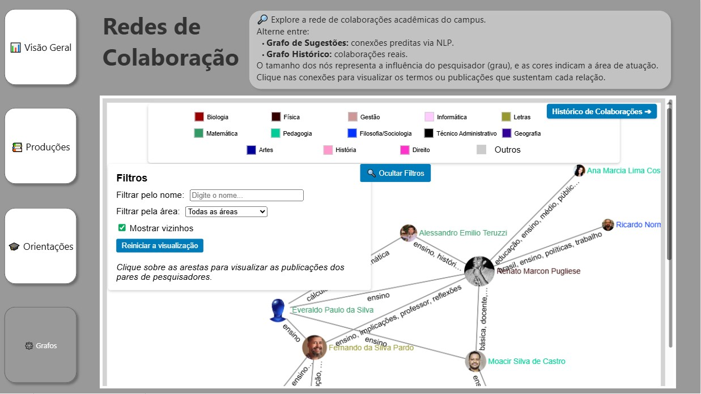

# 📊 Dashboard Executivo: Redes de Colaboração Acadêmica (IFSP)

> **⚠️ Nota de Arquitetura e Histórico:** Este repositório foca exclusivamente na **Camada de Visualização (Business Intelligence)** e na **Modelagem Dimensional**. Ele atua como uma evolução tecnológica e migração direta do [Dashboard original em Looker Studio](https://lookerstudio.google.com/u/2/reporting/ed032ec2-fb89-4434-884f-c411716facee/page/4cWFF), portando as mesmas métricas para o ecossistema da Microsoft. Todo o pipeline de Engenharia de Dados (ETL), Processamento de Linguagem Natural (NLP) e algoritmos de Redes Complexas (Graph Analytics) foi desenvolvido em Python e encontra-se documentado no repositório principal.
> 🔗 **[Acessar o Pipeline de Data Science (Repositório Principal)](https://github.com/lbaffa/analise-colaboracao-academica-ifsp.git)**

Este projeto traduz matrizes topológicas e milhares de registros da Plataforma Lattes em um produto de dados interativo. Desenvolvido em **Power BI**, o dashboard atua como uma ferramenta de diagnóstico e planejamento estratégico, permitindo à gestão do IFSP — Câmpus Pirituba explorar as redes de colaboração interna, identificar polos de pesquisa e analisar recomendações de novas parcerias geradas por Inteligência Artificial (*Explainable AI*).

## 👁️ Visão Geral do Produto (Preview)

<p align="center">
  
</p>

## 📸 Telas do Dashboard

A interface foi projetada sob o conceito de *Self-Service Analytics*, dividida em visões macro e detalhamentos focados:

| Visão Geral (KPIs e Demografia) | Análise de Produções Bibliográficas |
| :---: | :---: |
|  |  |
| **Métricas de Orientações Acadêmicas** | **Topologia e Grafos (NLP)** |
|  |  |

## 🎯 Contexto e Principais Insights de Negócio

A análise cobre o período histórico de 2016 a março de 2025, transformando dados brutos em inteligência institucional. Através da exploração do dashboard, é possível constatar:

* **Mapeamento do Capital Intelectual:** Monitoramento de 169 pesquisadores, totalizando 1.050 produções bibliográficas e 465 orientações concluídas no período.
* **Concentração de Esforços:** Aproximadamente 70% de toda a produção científica do câmpus está concentrada em apenas 4 áreas estratégicas (Gestão, Letras, Matemática e Informática).
* **Impacto Sazonal:** Identificação clara de um pico de orientações entre os anos de 2021 e 2023.
* **Redes de Colaboração:** Visualização espacial das parcerias reais versus as predições algorítmicas, evidenciando o grau de influência de cada pesquisador na rede institucional.

## 🛠️ Desafios Técnicos e Soluções em BI

Para garantir a performance e a integridade analítica do painel, as seguintes técnicas de Business Intelligence foram aplicadas na construção do `.pbix`:

### 1. Modelagem Dimensional e Resolução de Cardinalidade (Galaxy Schema)
A base de métricas original (`metrics_bi.csv`) possuía granularidade temporal (cada pesquisador repetia 10 vezes, uma para cada ano analisado). Tentar conectar essa base diretamente a tabelas especializadas gerava um conflito de cardinalidade **Muitos-para-Muitos (*:*)**, quebrando os filtros cruzados do dashboard.
* **Solução:** Implementação de um autêntico modelo Galaxy Schema via **Power Query**. A base original foi particionada: aplicou-se o `Unpivot` para criar Tabelas Fato especializadas (`Fato_Producoes` e `Fato_Orientacoes`) e extraiu-se uma **Tabela Dimensão customizada** (`Dim_Pesq_Areas`), removendo duplicatas para criar uma lista única e confiável de pesquisadores. Essa Dimensão assumiu o centro do modelo (Lado 1), propagando os filtros perfeitamente para as tabelas Fato (Lado Muitos). 
* **Isolamento Arquitetural:** Para evitar conflitos de granularidade, a base `lattes_bi.csv` foi isolada, sendo utilizada **exclusivamente** para alimentar a matriz nominal da relação de pesquisadores na Página 1 (Visão Geral). Todos os demais gráficos, séries temporais e cálculos do dashboard foram gerados estritamente a partir da modelagem derivada da `metrics_bi.csv`.

### 2. Governança e Transparência de Dados
Em alinhamento com as melhores práticas de gestão da informação, categorias textuais temporariamente sem ocorrências numéricas (ex: áreas de atuação sem publicações no ano filtrado) foram **mantidas intencionalmente visíveis** nos eixos dos gráficos. O princípio adotado é que *"ausência de dado também é dado"*, permitindo aos gestores identificar lacunas de pesquisa e direcionar fomento de forma transparente. Adicionalmente, os arquivos brutos do repositório original (`_looker_studio.csv`) foram semanticamente renomeados para `_bi.csv` neste projeto, refletindo o novo escopo tecnológico sem perder o rastreio da origem.

### 3. UX/UI Design e Navegação
A interface foge do padrão de relatórios estáticos, aproximando-se da experiência fluida de um *Web App*:
* **Cross-Filtering Nativo:** O núcleo da interatividade. Todos os elementos visuais interagem entre si; o clique em uma fatia de categoria (ex: Livros) recalcula e filtra toda a tela em tempo real sem distorcer as orientações associadas.
* **Navegação Lateral Dinâmica:** Construída com botões e formas sobrepostas para transição limpa entre as páginas.
* **Otimização de Espaço e Métricas (Tooltips):** Nomenclaturas longas e complexas inerentes à Plataforma Lattes foram condensadas nos gráficos visíveis. O detalhamento completo foi delegado às Dicas de Ferramenta (*Tooltips*), que foram configuradas para exibir não apenas os valores absolutos, mas também o **Percentual** exato de representatividade daquela fatia/barra em relação ao todo, preservando um design limpo e informativo.

## 📂 Estrutura do Repositório

```text
dashboard-colaboracao-academica-powerbi/
├── assets/                 # Mídias de demonstração (GIFs, Prints e PDF Executivo)
├── data/
│   └── processed/          # Artefatos estáticos (.csv) que alimentam o modelo dimensional
├── dashboard/              # Código-fonte (.pbix) contendo Power Query, Modelagem e UI
├── .gitignore              # Regras de exclusão de arquivos de sistema e temporários
└── README.md
```

## 🚀 Como Executar e Visualizar

1. **Visão Rápida:** Assista à demonstração interativa em vídeo no topo desta página ou visualize a exportação estática acessando `assets/full_report.pdf`.
2. **Exploração Completa:** Faça o download do arquivo fonte em `dashboard/collaboration_dashboard.pbix` e abra utilizando o [Power BI Desktop](https://powerbi.microsoft.com/desktop/).

> ⚙️ **Nota sobre a Fonte de Dados e Refresh:** > O arquivo `.pbix` já contém o modelo de dados embutido (*Import Mode*) com o estado final da extração, permitindo navegação completa e imediata assim que aberto. Caso deseje acionar a rotina de atualização (Refresh) ou auditar o pipeline de transformação localmente, faça o download da pasta `/data/processed`, abra o editor do **Power Query** (`Transformar Dados`), e na etapa *Fonte* de cada tabela, ajuste o caminho absoluto do arquivo para refletir o seu diretório local.
